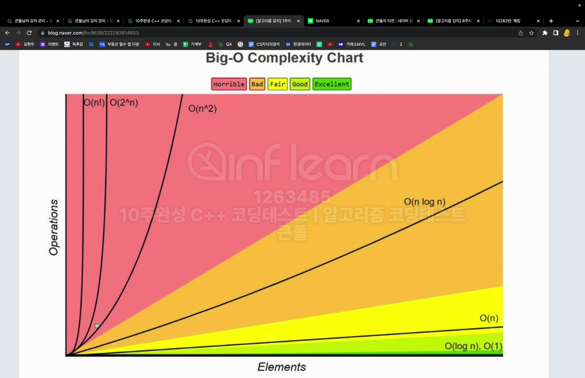

# 시간 복잡도
- 정의 
    - 입력크기에 대해 어떠한 알고리즘이 실행되는데 걸리는 시간
    - 주요로직의 반복 횟수를 중점으로 측정
       - 컴퓨터 시간은 사양이나 cup, 램 상태에 따라 또 다르기 때문에 시간을 중점으로 하지않음
--------
# 빅오 표기법
- 정의
    - 복잡도에 가장 영향을 많이 끼치는 항의 상수인자를 빼고 나머지 항을 없애서 복잡도를 나타내는 표기법
    - 입력 크기가 커질수록 증가속도가 많이 올라가면 더 영향을 많이 끼친다
    - ex) O(n), O(1), O(longN)....
- 상수 시간복잡도(O(1))
    - 입력 크기와 상관없이 일정한 시간 복잡도를 가짐
    - cin. cout, scanf, printf, 곱하기, 간단한 비교 if(a == 2), 배열의 index 참조

- 시간 복잡도를 구해 빅오표기법으로 나타내는 팁!!
    - 어림잡아 풀기(문제풀땐 이걸로 풀어도 됨)
        - 중요 로직의 cnt를 비교
        - i = ?일때 j = ?, 를 몇번 반복해 손코딩
        - 손코딩을 그림으로 그려, 이를 기반으로 시간 복잡도를 구함
        - 우수리 때고 남은 값으로 빅오표기
    - 정석
        - cnt를 이용해 점화식을 구해야함
    - 재귀 함수
        - Main Logic * 함수 호출 횟수