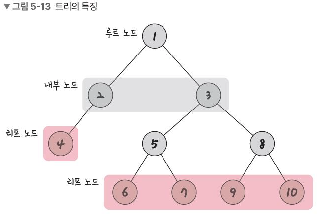
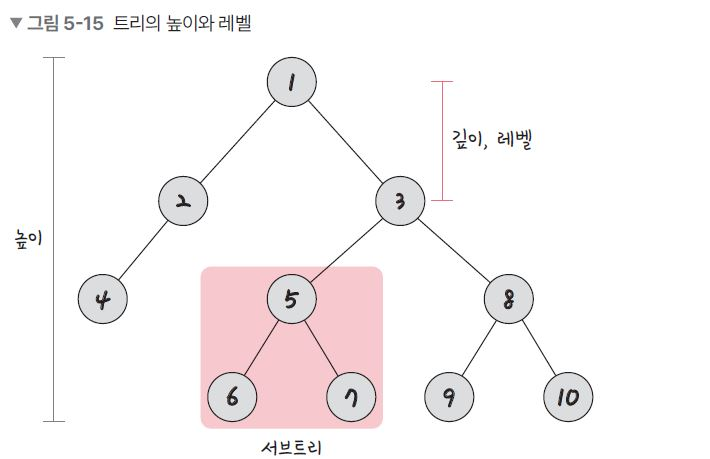

# 트리(Tree Data Struct)
- 정의
    - 자식 노드와 부모 노드로 이루어진 계층적인 구조를 가지며 무방향 그래프의 일종이자 사이클이 없는 자료구조
- 특징 
    1. 부모, 자식 계층 구조를 가짐
    2. V(노드 수)-1 = E(간선 수)
    3. 임의 두 노드 사이의 경로는 '유일무이'하게 존재 - 트리 내의 어떤 노드와 어떤 노드까지 경로는 반드시 하나만 존재
- 명칭
    - 루트 노드 : 가장 위에있는 노드, 보통 트리 문제가 나오고 트리 탐색시 루트 노드 중심으로 하면 쉽게 풀리는 경우 많음
    - 내부 노드 : 루트 노드와 리프 노드 사이에 있는 노드
    - 리프 노드 : 자식이 없는 노드
- 트리의 높이와 레벨
    - 깊이 : 트리의 깊이는 각각 노드마다 다르며 루트 노드에서 특정 노드까지 최단거리로 갔을 때 거리
    - 높이 : 루트 노드부터 리프 노드까지의 거리 중 가장 긴 거리
    - 레벨 : 문제마다 다르지만 보통 깊이와 같은 의미
    - 서브트리 : 트리 내의 하위 집합(부분 집합) - 그림의 5,6,7 노드
    - 숲(forest) : 트리로 이뤄진 집합