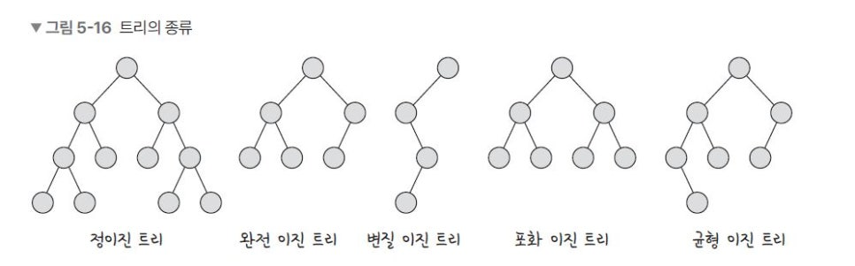
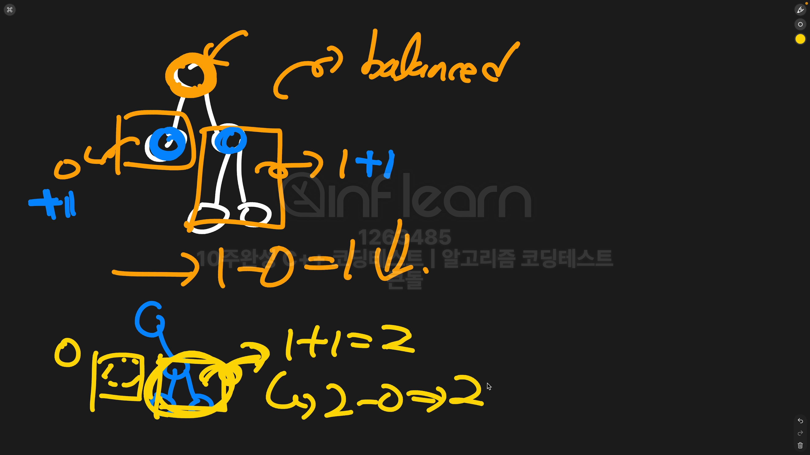

# 이진트리(Binary Tree, BT)
- 정의
    - 각각의 노드의 자식의 수가 2개 이하로 구성된 트리
- 종류
    - 정이진 트리(Full Binary Tree)
        - 자식노드가 0 또는 2개
    - 완전 이진 트리(Complete Binary Tree)
        - 왼쪽부터 채워져 있는 이진트리
        - 마지막 레벨을 제외하고 모든 레벨이 완전히 채워져 있으며 마지막 레벨의 경우 왼쪽부터 채워져 있음
    - 변질 이진 트리(Degenerate Binary Tree)
        - 리프노드 제외, 자식노드가 하나뿐인 이진트리
    - 포화 이진 트리(Perfect Binary Tree)
        - 모든 노드가 꽉찬 이진트리
    - 균형 이진 틀(Balanced Binary Tree)
        - 트리의 모든 노드에 대해 그 노드의 왼쪽 하위 트리와 오른쪽 하위 트리의 높이 차이가 1 이하인 이진트리
        - 어느 한쪽으로 지나치게 치우치지 않는 구조 유지
        - 탐색, 삽입, 삭제등 연산에 O(logN)
        - AVL, Red-Black Tree(map, set 자료구조의 구현체 : 탐색, 삽입, 삭제등 연산에 O(logN))

- 문제
    - 위의 그림에서 첫번째 트리를 보면 노드의 왼쪽 하위 노드와 오른쪽 하위 노드의 높이 차가 0 - 1로 균형 이진 트리다
    - 이제부턴 문제를 풀땐 정점이 있다면 높이에 +1을 한 뒤에 연산을 해주자!!
    - 그 이유는 두번째 그림처럼 정점이 없는 경우가 있을 수 있는데 이때 높이를 비교해보면 높이 차가 1이 된다
    - 이런 것을 방지하고자 정점이 있다면 +1을 한뒤 높이를 비교해서 풀자 