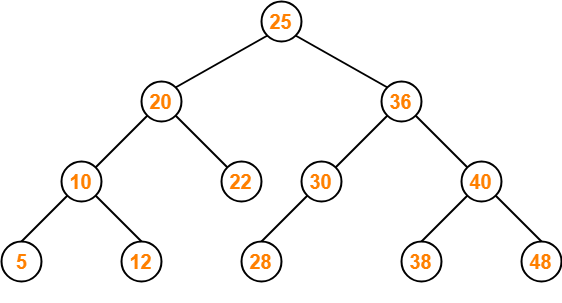

# 이진탐색트리(BST, Binary Search Tree)
- 정의
    - 이진트리의 일종으로 오른쪽 하위 트리는 노드의 값보다 큰 값인 노드만 포함, 왼쪽 하위 트리는 노드의 값보다 작은 값이 들어있는 트리
    - 왼쪽 및 오른쪽 하위 트리도 해당 특성을 가짐
    - 검색에 용이
- 시간 복잡도
    - 균형잡히게 분포되었다면 탐색, 삽입 삭제 수정 모두 O(logN)
    - 최악의 경우 삽입 순서에 따라 최악의 경우가 만들어지며 O(N)의 시간 복잡도를 가질 수 있음
        - ex) 1,2,3,4 순으로 삽입되어 선형으로 이진트리가 완성될 수 있음
        - 이를 해결하기 위해 어떻게 되는 트리의 노드를 회전시키는 방법을 통해 균형잡히게 만든게 AVL, 레드블랙 트리가 있음
        - ex)map이 삽입 탐색 삭제 수정이 O(lonN)임을 보장받는 이유는 레드블랙트리 기반 구현이기 때문